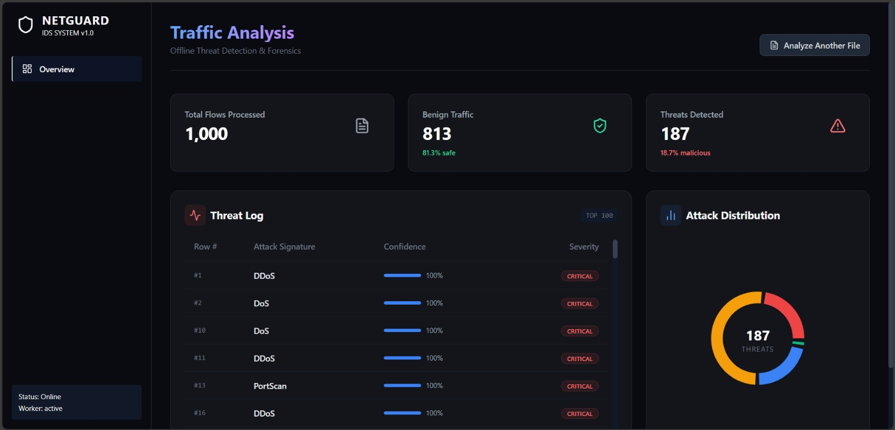
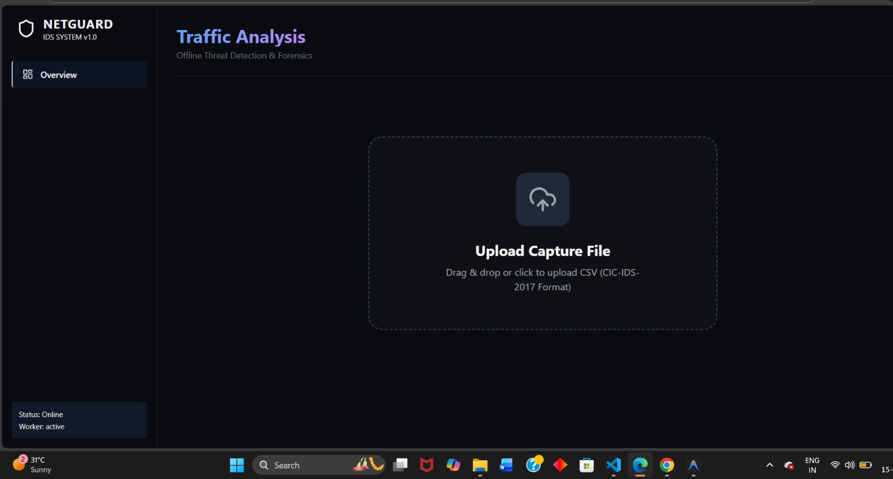
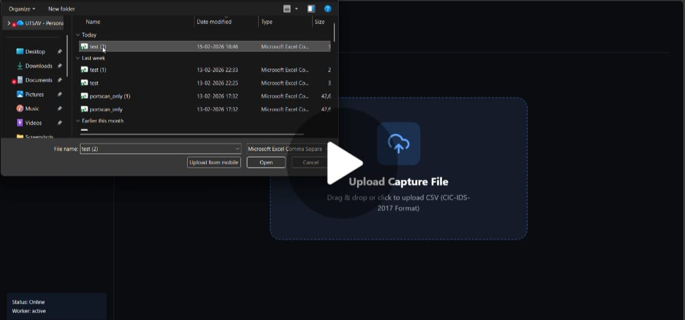

<h1 align="center">AI Intrusion Detection Dashboard 🤖</h1>

<p align="center">
  
</p>

<div align="center">
  <strong>NETGUARD is an AI-powered Intrusion Detection System that analyzes network traffic using Machine Learning models trained on CIC-IDS-2017 to detect and classify cyber attacks in real-time.</strong>
</div>

<br />

## 📑 Table of Contents

- [About the Project](#-about-the-project)
- [Results](#-results)
- [Tech Stack](#️-tech-stack)
- [File Structure](#-file-structure)
- [Dataset](#-dataset-cic-ids-2017)
- [Model Architecture](#-model-architecture)
- [Installation and Setup](#-installation-and-setup)
- [Future Scope](#-future-scope)
- [Acknowledgements](#-acknowledgement)
- [Contributors](#-contributors)

---

## 📘 About the Project

This project focuses on building a real-time AI-powered Intrusion Detection System (IDS) capable of detecting malicious network activity using Machine Learning techniques. The system analyzes network traffic data formatted according to the CIC-IDS-2017 dataset and classifies it into benign or malicious categories.

The pipeline consists of:

1. Data preprocessing and feature cleaning  
2. Binary classification (Benign vs Malicious)  
3. Multi-class classification (Specific Attack Type Identification)  
4. Real-time WebSocket communication  
5. Interactive React-based analytics dashboard  

The backend is built using **FastAPI**, and the frontend uses **React + Vite + TailwindCSS**, enabling real-time threat visualization and forensic analysis.

---

## 📊 Results

### Dashboard Preview

<p align="center">
  
</p>

## 🎥 Demo Video

<p align="center">
  <a href="media/netguardDemo.mp4">
    
  </a>
</p>

### System Capabilities

- Binary Threat Detection
- Multi-Class Attack Classification
- Real-Time WebSocket Updates
- Confidence Score Calculation
- Severity Tagging (CRITICAL / HIGH / MEDIUM)
- Attack Distribution Analytics
- CSV Upload (CIC-IDS-2017 Format)

---

## ⚙️ Tech Stack

| **Category**                | **Technologies**                                                                                       |
|-----------------------------|----------------------------------------------------------------------------------------------------|
| **Programming Languages**   |   |
| **Backend Framework**       |  |
| **Frontend Framework**      |   |
| **Styling**                 |  |
| **Visualization**           |  |
| **Machine Learning**        |  |
| **Dataset**                 | CIC-IDS-2017 |
| **Tools**                   | Git, Vite, WebSockets |

---

## 📁 File Structure

```
AI-INTRUSION-DETECTION-DASHBOARD
│
├── ids_backend
│   ├── app
│   │   ├── api
│   │   ├── models
│   │   │   ├── binary
│   │   │   ├── multiclass
│   │   │   ├── loader.py
│   │   │   ├── metadata.py
│   │   ├── preprocessing
│   │   │   ├── clean.py
│   │   ├── services
│   │   │   ├── inference.py
│   │   │   ├── metrics.py
│   │   ├── main.py
│   │   ├── config.py
│   ├── requirements.txt
│
├── ids_frontend
│   ├── src
│   ├── public
│   ├── package.json
│
└── README.md
```

---

## 💾 Dataset: CIC-IDS-2017

The **CIC-IDS-2017** dataset contains realistic network traffic data including both benign activity and modern attack scenarios.

### Attack Categories Include:

- DDoS
- DoS
- PortScan
- Brute Force
- Web Attacks
- Botnet
- Infiltration

### Features

- Flow Duration
- Total Fwd Packets
- Total Backward Packets
- Packet Length Statistics
- Flow Bytes/s
- Flow Packets/s
- Header Length
- Flag Counts
- And more…

The dataset is used to train:

- Binary Classification Model  
- Multi-Class Classification Model  

---

## 🤖 Model Architecture

### Format 1: Binary + Multi-Class ML Pipeline

1. Data Cleaning & Feature Engineering  
   - Remove null values  
   - Normalize features  
   - Encode labels  

2. Binary Classifier  
   - Predicts: Benign or Malicious  
   - Provides probability confidence  

3. Multi-Class Classifier  
   - Activated if malicious  
   - Predicts attack type (DDoS, DoS, etc.)  

4. Inference Service  
   - Combines predictions  
   - Assigns severity level  

5. WebSocket Stream  
   - Sends predictions to frontend in real-time  

---

### Backend Initialization

```python
@app.on_event("startup")
async def startup():
    load_models()
```

### WebSocket Endpoint

```
/ws
```

---

## 🌐 System Workflow

```
User Upload (CSV)
        ↓
FastAPI Backend
        ↓
Preprocessing Pipeline
        ↓
Binary Model
        ↓
Multi-Class Model
        ↓
WebSocket
        ↓
React Dashboard (Live Visualization)
```

---

## 💻 Installation and Setup

### Backend

```bash
cd ids_backend
pip install -r requirements.txt
uvicorn app.main:app --reload
```

Backend runs at:
```
http://localhost:8000
```

---

### Frontend

```bash
cd ids_frontend
npm install
npm run dev
```

Frontend runs at:
```
http://localhost:5173
```

---

## 🌟 Future Scope

1. Real-Time Packet Sniffing (Scapy Integration)
2. Database Logging (PostgreSQL / MongoDB)
3. Authentication & Role-Based Access
4. Docker Deployment
5. Kubernetes Scalability
6. SIEM Integration
7. Email / Slack Alert Notifications
8. Model Auto-Retraining Pipeline
9. Creating Dataset with Tshark

---

## 📜 Acknowledgement

We acknowledge the creators of the CIC-IDS-2017 dataset for providing a realistic benchmark for intrusion detection research.

Special thanks to open-source tools including:

- FastAPI
- React
- TailwindCSS
- Recharts
- Scikit-learn

---

## 👥 Contributors

- Utsav Ojha
- Tarun Kumar Bajotra
- Harsh Sankhe
- Sanskar Tarte
